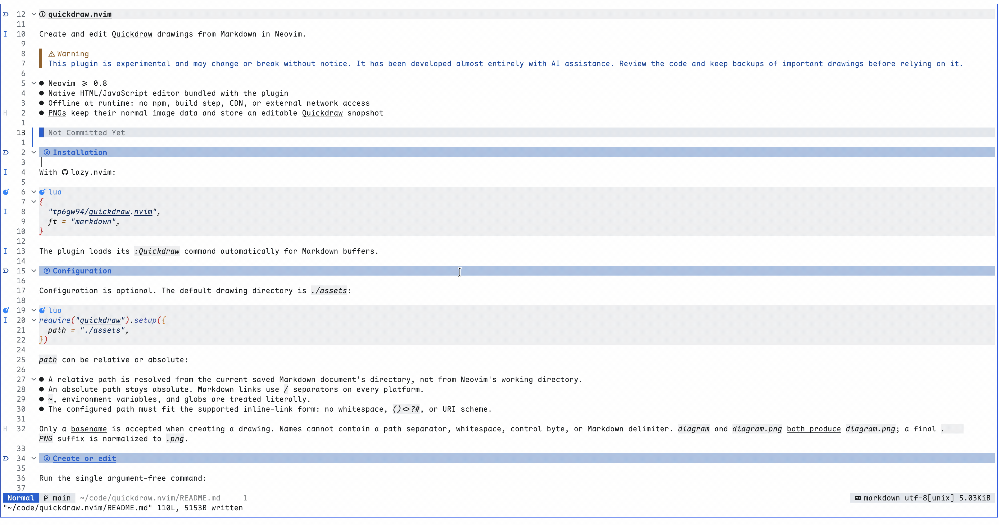

# quickdraw.nvim

Create and edit Quickdraw drawings from Markdown in Neovim.

> [!WARNING]
> This plugin is experimental and may change or break without notice. It has been developed almost entirely with AI assistance. Review the code and keep backups of important drawings before relying on it.

- Neovim >= 0.8
- Native HTML/JavaScript editor bundled with the plugin
- Offline at runtime: no npm, build step, CDN, or external network access
- PNGs keep their normal image data and store an editable Quickdraw snapshot



## Installation

With [lazy.nvim](https://github.com/folke/lazy.nvim):

```lua
{
  "tp6gw94/quickdraw.nvim",
  ft = "markdown",
}
```

The plugin loads its `:Quickdraw` command automatically for Markdown buffers.

## Configuration

Configuration is optional. The default drawing directory is `./assets`:

```lua
require("quickdraw").setup({
  path = "./assets",
})
```

`path` can be relative or absolute:

- A relative path is resolved from the current saved Markdown document's directory, not from Neovim's working directory.
- An absolute path stays absolute. Markdown links use `/` separators on every platform.
- `~`, environment variables, and globs are treated literally.
- The configured path must fit the supported inline-link form: no whitespace, `()<>?#`, or URI scheme.

Only a basename is accepted when creating a drawing. Names cannot contain a path separator, whitespace, control byte, or Markdown delimiter. `diagram` and `diagram.png` both produce `diagram.png`; a final `.PNG` suffix is normalized to `.png`.

## Create or edit

Run the single argument-free command:

```vim
:Quickdraw
```

The command chooses its action from the cursor position:

1. On a supported inline Quickdraw image link, it opens that PNG for editing.
2. Elsewhere in a Markdown buffer, it prompts for a drawing basename and checks the target path.
3. If that name already exists, it refuses to open or overwrite it and asks you to choose another name.
4. Otherwise it creates a valid blank Quickdraw PNG before starting the browser session.
5. After the PNG and session are ready, it inserts an empty-alt link at the original cursor position:

   ```markdown
   
   ```

The inserted link therefore points to an existing PNG immediately. The Markdown buffer itself is not written automatically; save it with Neovim when you are ready. Starting another drawing replaces the one active in the current Neovim process; only one editor session is active at a time.

## Supported edit links

Cursor-based editing intentionally supports this constrained inline form:

```markdown

```

The image must be on one line, the cursor must be between `!` and `)`, and the destination must be a local path ending in `.png` (case-insensitive). Relative destinations use the Markdown document directory; absolute POSIX, Windows drive, and UNC paths remain absolute.

Reference-style images, titles, multiline images, angle-bracket destinations, remote URLs, URI schemes, query strings, fragments, whitespace, and nested parentheses are not parsed. Unsupported image syntax follows the create flow instead of being treated as an edit link.

A linked missing PNG is created as a valid blank Quickdraw PNG before the browser opens. An existing Quickdraw PNG opens for editing. An existing ordinary or invalid PNG is rejected and is never overwritten.

## Save status

The browser shows the current persistence state in the top-right corner. Every successful load starts at **Saved** because the PNG already exists.

- **Saved** — the displayed drawing is stored in the PNG.
- **Unsaved** — the drawing changed after the last successful save.
- **Saving…** — a save is in progress.
- **Save failed** — the latest save did not reach the PNG; the error alert remains visible until the next edit or successful save.

Use `Ctrl+S` or `Cmd+S`, or choose **Export as PNG** from the board menu. Saving an empty board is supported. Quickdraw does not autosave.

## Browser fallback

The editor is normally opened in the default browser. If that launch fails, the session remains active and Quickdraw shows a notification containing the local URL. Open that URL manually; it is valid only while that session is running.

## Troubleshooting

- **"Quickdraw requires a Markdown buffer"** — set the buffer filetype to `markdown`.
- **Relative path error** — save the Markdown document before creating a drawing; relative paths need its directory.
- **Invalid drawing name** — enter a basename such as `diagram` or `diagram.png`, not a path.
- **Drawing already exists** — choose another basename; prompted creation never opens or overwrites a same-name target.
- **PNG is not editable** — the file is not a valid Quickdraw PNG; it will not be overwritten.
- **Browser did not open** — use the URL in the warning notification.
- **No link was inserted** — canceling, an invalid input, a failed session, or a changed/non-modifiable buffer leaves the Markdown text unchanged.

## License

MIT. The bundled Quickdraw core is also MIT-licensed; see `web/quickdraw/vendor/@quickdrawjs/core/LICENSE`.
